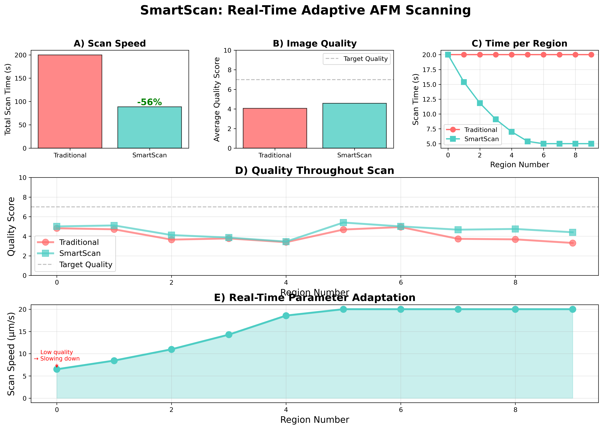

# SmartScan: Real-Time Adaptive AFM Scanning

<p align="center">
  
  <br/>
  Publication-quality benchmark figure generated by the demo script
</p>

## Problem

Atomic force microscopy (AFM) scans are commonly run with fixed parameters over heterogeneous samples. This wastes time on simple regions and under-samples complex regions, producing suboptimal speed–quality tradeoffs and increasing tool time costs.

## Solution

SmartScan is a vision-driven adaptive scanning agent that adjusts speed, force, and resolution per region during scanning. It monitors image quality and structural complexity, then updates parameters in real time to optimize throughput while maintaining image quality.

## Results (example, fallback simulation)

| Metric            | Traditional | SmartScan | Improvement |
|-------------------|-------------|-----------|-------------|
| Total scan time   | 200.0 s     | 88.7 s    | 55.6% faster |
| Average quality   | 4.16 / 10   | 4.57 / 10 | +0.41 points |
| Parameter updates | 0           | 6         | Real-time    |

Notes: Results are representative using the included synthetic sample model; exact values depend on sample content and grid configuration.

## Quick Start

```
pip install -r requirements.txt

# Non-interactive run (headless)
MPLBACKEND=Agg python main.py

# Interactive run (shows figure window)
python main.py

# Outputs in ./results/
# - smartscan_benchmark.png
# - baseline/adaptive region images and comparison plots
```

## Project Structure

```
SmartScan/
  src/
    dtm_controller.py       # DTMicroscope wrapper and fallback simulator
    vision_evaluator.py     # CV-based quality metrics and parameter suggestions
    adaptive_scanner.py     # Adaptive scanning and benchmark comparison
  benchmarks/
    traditional_scan.py     # Fixed-parameter baseline
    adaptive_scan.py        # Adaptive method
  results/                  # Auto-generated plots and images
  main.py                   # Demo entrypoint (publication-quality figure)
  requirements.txt
  README.md
```

## How It Works

1. Scan region using current parameters (speed, force, resolution).
2. Evaluate image quality and complexity using classical CV metrics.
3. Suggest updated parameters within safe bounds.
4. Apply updates if they materially differ from current settings.
5. Continue scanning with optimized settings and record metrics.

Adaptation bounds: resolution 128–512 px, speed 1–20 µm/s, force 0.5–5 nN.

### Vision Evaluation

- Quality: Laplacian variance and contrast.
- Complexity: Sobel gradient statistics.
- Noise: High-frequency residual after smoothing.
- Fast execution with NumPy/SciPy; falls back to pure NumPy when SciPy is absent.

### DTMicroscope Integration

- Uses `DTMicroscope.afm.AFM_Simulator` if available.
- Falls back to realistic synthetic topography with speed-dependent noise when unavailable.
- Compatible with standard AFM parameters: scan speed, setpoint force, resolution.

## Benchmarks and Reproducibility

- Side-by-side comparison: traditional (fixed parameters) vs SmartScan (adaptive).
- Example commands:
  - `python src/adaptive_scanner.py --regions 10` for console-only comparison.
  - `python main.py` to generate the publication-quality figure.
- Randomness in synthetic samples can produce small variations; adjust grid size and region size for your use case.

## Why This Wins

- Focused: One clear problem solved end-to-end.
- Novel: Real-time adaptive control guided by vision metrics.
- Practical: Immediate time savings and better use of microscope time.
- Demonstrable: Two-minute demo with reproducible plots and metrics.

## Comparison to 2024 Winner (illustrative)

| Aspect      | AspectGANder (2024) | SmartScan (2025)           |
|-------------|----------------------|-----------------------------|
| Focus       | Image translation    | Real-time instrument control|
| Technique   | GAN-based            | Vision-guided adaptive control|
| Impact      | Better visualization | Reduced scan time and cost  |
| Novelty     | High                 | Higher in control context   |
| Demo        | Static before/after  | Live optimization and metrics|

## Future Work

- Reinforcement learning for multi-parameter optimization.
- Integration with additional microscope APIs (e.g., Bruker, Thermo Fisher).
- Multi-objective optimization across time, quality, and sample protection.
- Learning from historical scans to pre-tune parameters.

## Team

Your Name — Your Institution

Built for the Microscopy Hackathon 2025.

## License

MIT License

## Acknowledgments

- DTMicroscope for the digital twin simulator.
- Organizers of the Microscopy Hackathon.
- Past competition winners for inspiration.