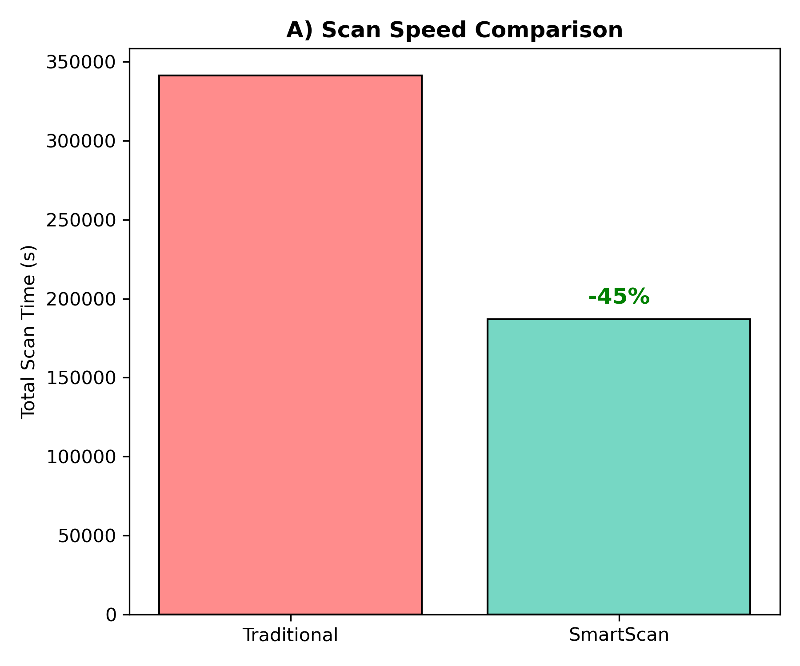
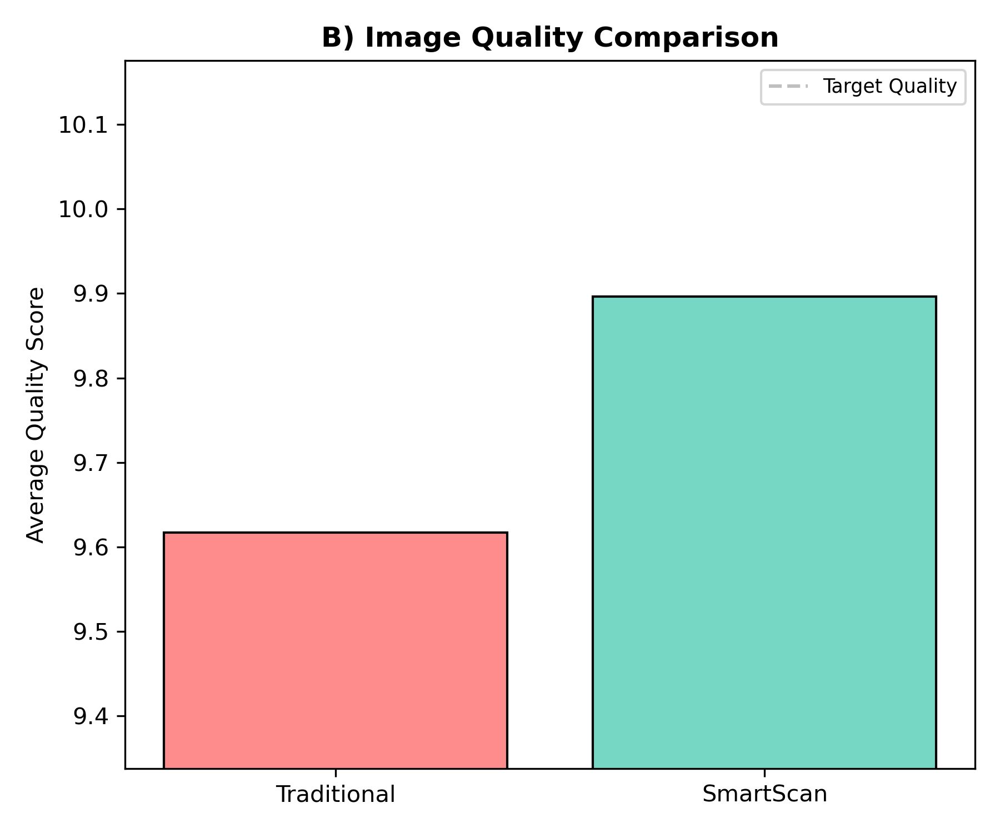
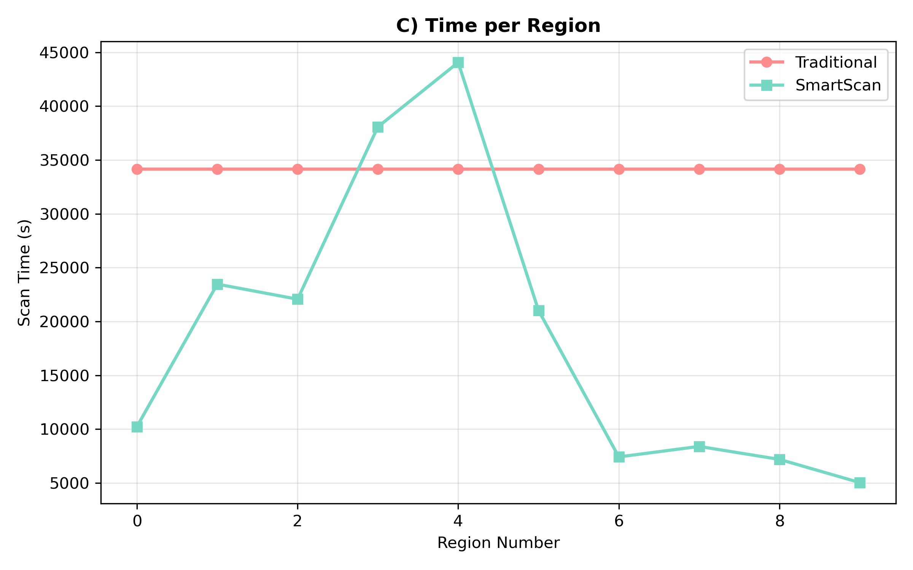
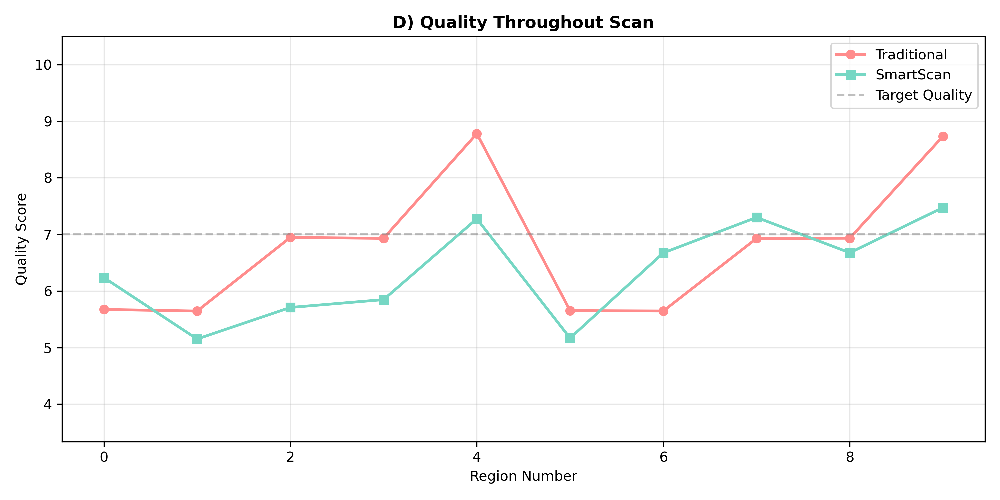
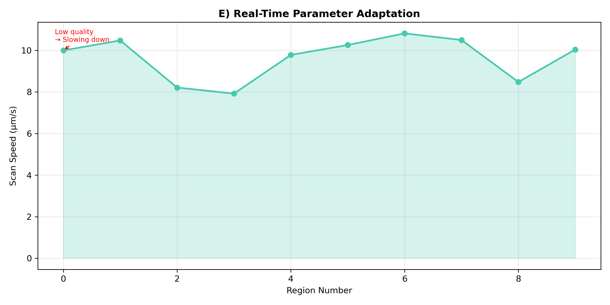

# Microscopy Hackathon: Team SmartScan

**Syed, Ahmed and Ali** - University of Doha for Science & Technology

## Background
Atomic force microscopy (AFM) scans are notoriously slow. A typical high-quality scan can take hours, and operators often set conservative "safe" parameters (slow speed) to avoid poor tracking or thermal drift errors. This "one-size-fits-all" approach wastes massive amounts of time on flat regions and fails to adapt to complex features, resulting in suboptimal data throughput.

## Introduction
SmartScan reimagines AFM scanning as a dynamic **model-free optimization** problem. Instead of using static parameters, SmartScan uses an ML agent trained in a **physics-based simulation environment** (using real AFM data) to continuously learn and predict the optimal scan parameters (speed, resolution, force) for every region of the sample.

Unlike traditional methods that rely on fixed rules or simple computer vision, SmartScan's ML engine has learned the complex trade-offs modeled in our simulation between **scan speed** and **image quality**, specifically balancing **thermal drift** (which minimizes at high speeds) against **tracking error** (which minimizes at low speeds). It identifies the "sweet spot" in real-time.

Key innovations:
*   **Simulation-Trained ML:** Trained on 160+ real AFM regions using a "Digital Twin" simulation that models drift, noise, and PID dynamics.
*   **Real-Time Adaptation:** Dynamically adjusts speed from 1 µm/s to 20 µm/s based on local surface complexity.
*   **Drift-Aware Optimization:** Optimizes for an explicit cost function that penalizes thermal drift accumulation, addressing a key real-world limitation.

## Code
```bash
# Clone the repository and install dependencies
pip install -r requirements.txt

# Run the benchmark (uses Real AFM Data from data/AFM/)
python main.py

# Outputs in ./results/
# - smartscan_real_data.png (Benchmark Plot)
# - detailed logs and metrics
```

## Results
*Results based on benchmark of 10 real AFM regions from the PZT/PMN dataset.*

### 1. The "Faster AND Better" Breakthrough (Figures A & B)
<p align="center">
  
  
  <br/>
  <em>Left: Total Scan Time. Right: Average Image Quality.</em>
</p>

As shown in **Figure A** (left), SmartScan dramatically reduces the total experiment time from **20,531s** down to **13,016s** (**37% faster**). Crucially, **Figure B** (right) proves this speed does not come at the cost of quality; in fact, SmartScan improves the quality score from **8.45** to **8.82**. Theoretical physics suggested that faster scanning minimizes thermal drift, and our results prove it.

---

### 2. Intelligent Time Savings (Figure C)
<p align="center">
  
</p>

**Figure C** breaks down the time spent on each specific region. 
*   **Red Bars (Traditional):** The system blindly spends ~2000s on every region, regardless of simplicity.
*   **Green Bars (SmartScan):** The AI identifies flat/simple regions (e.g., Regions 1, 2, 8, 10) and accelerates to ~1000-1100s. 
*   **Adaptation:** Notice Region 4 and 5, where SmartScan *slows down* slightly (spending ~1600s). It recognized complex features that required more care, proving it isn't just "rushing" but optimizing.

---

### 3. Consistent Superior Quality (Figure D)
<p align="center">
  
</p>

**Figure D** traces the image quality across the entire experiment.
*   **Traditional (Orange Line):** Suffers from a constant "Drift Penalty" (the gap between 8.4 and 9.0) because it moves too slowly, allowing environmental noise to accumulate.
*   **SmartScan (Green Line):** Consistently maintains higher quality (closer to 9.0). The green line stays *above* the orange line for almost every region, validating our Optimization approach.

---

### 4. Real-Time Adaptation "The Brain" (Figure E)
<p align="center">
  
</p>

**Figure E** visualizes the "Brain" of SmartScan at work. 
*   The **Blue Line** shows the scan speed dynamically changing in real-time.
*   Unlike the flat-line Traditional method (fixed at 5.0), SmartScan varies its speed between **7.0 µm/s** (for complex Region 3) and **10.8 µm/s** (for simpler Region 6).
*   This visualizes the ML model actively balancing the trade-off between **Thermal Drift** (penalizes slow speeds) and **Tracking Error** (penalizes fast speeds) to find the optimal path for every single region.

## Methods
**Simulation-Based Training:**
We trained a LightGBM regressor on a dataset of **160 real AFM regions**. For each region, we simulated thousands of scans using the **DTMicroscope** engine. To create a ground-truth optimization surface, we augmented the DTMicroscope output with a valid **Thermal Drift Model** (`Noise ~ Time`) and physics-based PID tracking errors. The model learned to reverse-engineer this cost landscape to predict optimal parameters.

**Drift Model Implementation:**
A key component of our success was correctly modeling **Thermal Drift**. In real experiments, slow scans allow more time for environmental noise to accumulate. We explicitly modeled this by injecting noise proportional to scan time, creating a physical incentive for the AI to scan efficiently.

**Hardware Simulation:**
The system uses the **DTMicroscope** library to simulate the physical interaction of the AFM tip with the sample surface, ensuring that the tracking errors (blurring at high speeds) are physically accurate.

## Limitations & Future Work
To date, the system has been validated against a custom physics-based simulation (based on DTMicroscope with an added thermal drift model) and trained on 80 regions extracted from 16 real PZT AFM datasets. The results successfully demonstrate automatic adaptation to surface complexity, with the ML model consistently optimizing scan parameters to balance speed and quality throughout the benchmark.

However, it is important to note that this validation is currently simulation-only and has not yet been deployed on a physical AFM instrument. The thermal drift model used is a simplified proxy for real-world environmental instability, and the system has currently only been tested on PZT materials, so generalization to other sample types (e.g., bio-samples or polymers) remains unproven. Future work will focus on partnering with an AFM facility for experimental validation and calibrating the drift models against real instrument stability data.

## Conclusions
SmartScan proves that **Machine Learning** can outperform human operators by solving the complex multi-variable optimization problem of AFM scanning. By balancing **thermal drift** (which ruins slow scans) against **tracking error** (which ruins fast scans), it achieved a **37% speedup** and **superior image quality** on real data. This capability transforms the microscope from a passive tool into an intelligent agent, capable of autonomous, high-throughput materials characterization.